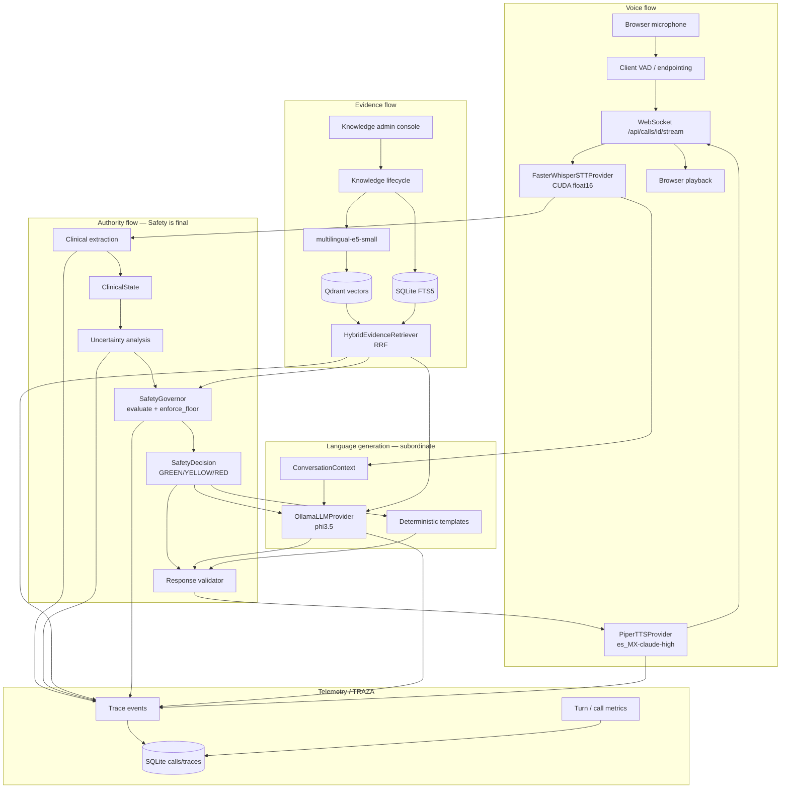

# LIMEN architecture diagram (submission)

Canonical modular-monolith architecture for Tech Sphere Challenge 2026.
Components named below exist in code (see consistency checklist at bottom).

## Export

1. Open this Mermaid in any Mermaid renderer (GitHub, mermaid.live, VS Code).
2. Export PNG/SVG for the jury package.
3. Keep this Markdown as the source of truth.

Exported PNG: [`assets/architecture.png`](assets/architecture.png).

## System architecture

## Flow roles

| Flow | Meaning |
| --- | --- |
| Voice | Mic → VAD → STT → … → TTS → playback |
| Authority | ClinicalState + rules → SafetyDecision; LLM cannot downgrade |
| Evidence | Upload/index → Hybrid RAG → typed EvidenceChunk + provenance |
| Telemetry | TRAZA stages + usage/timing without chain-of-thought |

## Code consistency checklist

| Diagram node | Code |
| --- | --- |
| SafetyGovernor | `limen/safety/governor.py` |
| HybridEvidenceRetriever | `limen/knowledge/hybrid.py` |
| OllamaLLMProvider | `limen/intelligence/providers/ollama.py` |
| FasterWhisperSTTProvider | `limen/voice/providers/faster_whisper_stt.py` |
| PiperTTSProvider | `limen/voice/providers/piper_tts.py` |
| ConversationContext | `limen/conversation/context.py` |
| TRAZA | `limen/tracing/`, `apps/api/routers/traces.py` |
| Knowledge lifecycle | `limen/knowledge/ingestion.py`, `deletion.py` |
| Admin console | `apps/web` `/knowledge` |

Detailed domain boundaries: [`ARCHITECTURE.md`](../../ARCHITECTURE.md), [`BACKEND.md`](../../BACKEND.md), [`FRONTEND.md`](../../FRONTEND.md).
