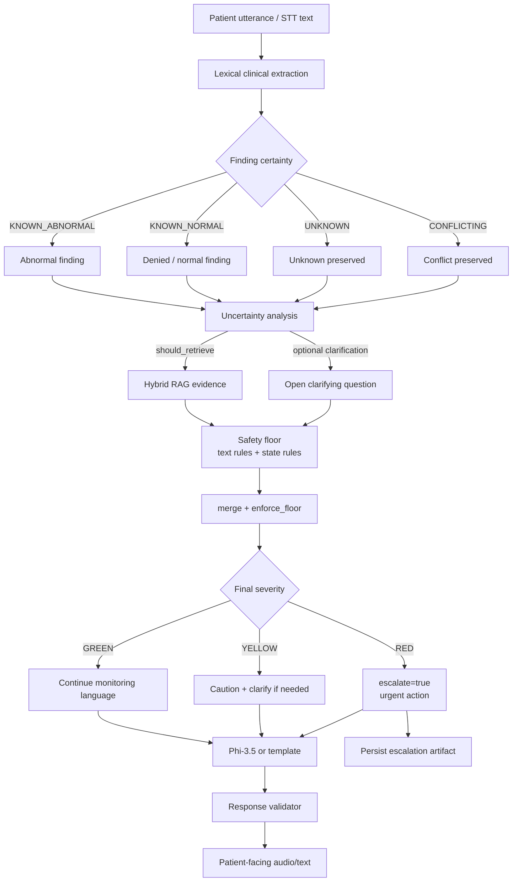

# Clinical decision flow (submission)

Shows how LIMEN turns patient information into an authoritative safety decision.
No chain-of-thought is logged or required.

## Decision Mermaid

## Non-negotiable rules

1. **`unknown != normal`** — missing information stays `UNKNOWN`; it is never coerced to “fine”.
2. **LLM cannot downgrade** — generative output passes through `enforce_floor`; a weaker proposal cannot reduce RED/YELLOW severity.
3. **RED stays RED** when deterministic patterns require it (`escalate=true`).
4. **Clarification** may be requested for high-impact unknowns, but must not delay obvious RED escalation.
5. **Evidence is data** — retrieved document text never becomes instruction authority.

## Related code

- Extraction: `limen/clinical/extraction.py`
- Uncertainty: `limen/clinical/uncertainty_analysis.py`
- Safety: `limen/safety/rules.py`, `limen/safety/governor.py`
- Orchestration: `limen/conversation/orchestrator.py`
