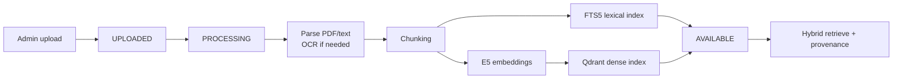
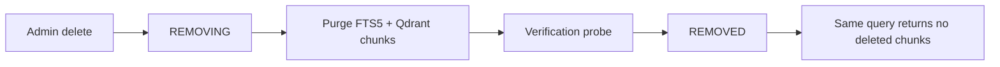

# Living knowledge flow (submission)

Supports G5 explanation: upload → use → delete → forget without restart.

## Ingest path

## Delete / forget path

## Truthful corpus status

| Item | Status |
| --- | --- |
| Official PDFs discovered | **107** (`docs/OFFICIAL_CORPUS.generated.md`) |
| Smoke indexed | **8** (0 failed, 357 chunks) |
| Full 107/107 ingestion | `FINAL_EVIDENCE_REQUIRED:OFFICIAL_CORPUS_FULL` |

Live G5 human admin-console confirmation: `FINAL_EVIDENCE_REQUIRED:G5_UI`

## Code

- Ingestion: `limen/knowledge/ingestion.py`
- Deletion: `limen/knowledge/deletion.py`
- Hybrid RAG: `limen/knowledge/hybrid.py`
- Admin UI: `apps/web/src/pages/Knowledge/KnowledgePage.tsx`
