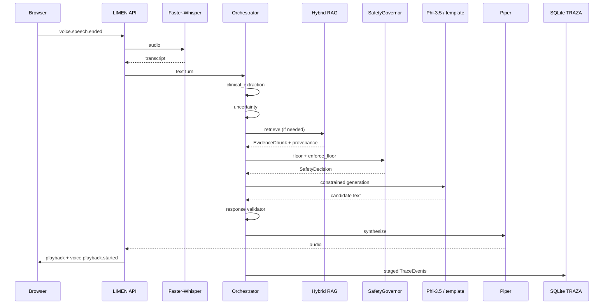

# TRAZA — turn reconstruction (submission)

TRAZA is LIMEN's inspectable decision trace. It reconstructs **what happened**,
not hidden model reasoning.

## One voice turn (conceptual)

## Typical TRAZA stages

`call.started` → `patient_statement` → `clinical_extraction` → `uncertainty` →
`retrieval` → `safety_evaluation` → `conversation` → `response` →
voice provider events (when applicable) → `session_end`

## Provenance

Retrieved evidence references include document id, chunk id, source name, and
page when available. Inspectors must verify content support — IDs alone are not
proof.

## UI / API

- UI: `/trace/:callId`
- API: `GET /api/traces/{call_id}`

No chain-of-thought is stored.
